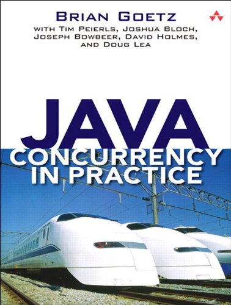

# java-concurrency-in-practice

The source code of the book "Java Concurrency in Practice (Brian Goetz)".

## Highlights
- Separate the code examples into different packages based on chapters.
- Add more comments to the code examples for understanding easily.

## Chapters
- [Chapter 1 Introduction](src/java/net/jcip/examples/ch01)
#### Part I: Fundamentals
- [Chapter 2 Thread Safety](src/java/net/jcip/examples/ch02)
- [Chapter 3 Sharing Objects](src/java/net/jcip/examples/ch03)
- [Chapter 4 Composing Objects](src/java/net/jcip/examples/ch04)
- [Chapter 5 Building Blocks](src/java/net/jcip/examples/ch05)
#### Part II: Structuring Concurrent Applications
- [Chapter 6 Task Execution](src/java/net/jcip/examples/ch06)
- [Chapter 7 Cancellation and Shutdown](src/java/net/jcip/examples/ch07)
- [Chapter 8 Applying Thread Pools](src/java/net/jcip/examples/ch08)
- [Chapter 9 GUI Applications](src/java/net/jcip/examples/ch09)
#### Part III: Liveness, Performance, and Testing
- [Chapter 10 Avoiding Liveness Hazards](src/java/net/jcip/examples/ch10)

## Study Notes
- [Study Notes](https://docs.google.com/document/d/1OBjN-ie35v49KTgdoDuw4CnVLWQ906LZOqVb3sYWZ9o/edit?usp=sharing)
